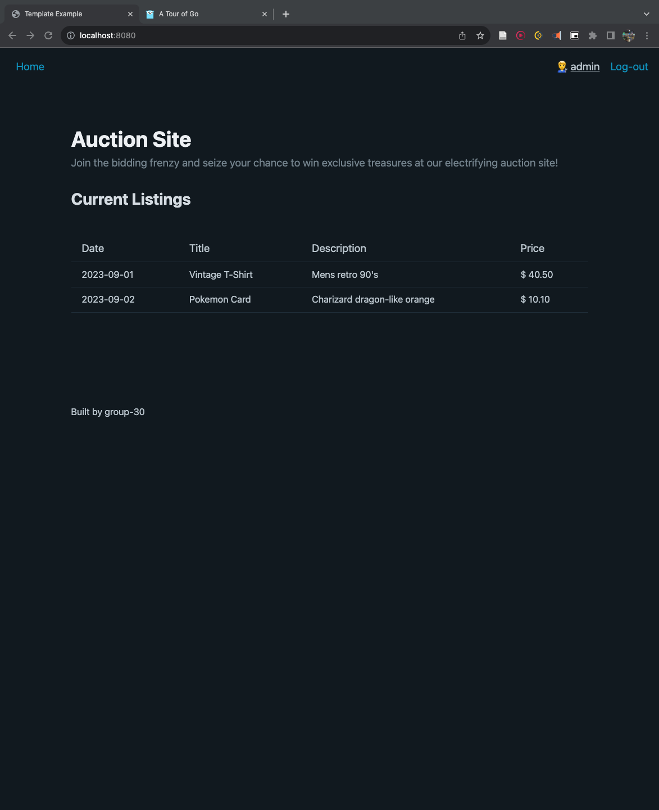

# CSRF Demo Instructions
* build the program
`go build -o ./tmp/main ./cmd/kodkod`

* run the binary
`./tmp/main`

# Build Tool for Live Reloading
`air -c .air.toml`
`air`

---

# Cross Site Request Forgery (CSRF)

- report: [https://docs.google.com/document/d/1lPW8Eg8lC_FI3tnrdd1jGDTngJBxdmPDHivksxXLz00/edit?usp=sharing](https://docs.google.com/document/d/1lPW8Eg8lC_FI3tnrdd1jGDTngJBxdmPDHivksxXLz00/edit?usp=sharing)

## Title
Tricking users into performing unauthorized actions through Cross-Site Request Forgery (CSRF)

## Introduction
- Auction website that allows an attacker to perform a CSRF attack on another user. 

## Objectives
- prepare a legitimate site that allows a user to login and generate a session.
- display an auction page that has a vulnerable `` tag that makes a forged request.
- perform an unintended action the legitimate site.

## Scope
- the auction site only has the minimum functionality handle a login.
- the vulnerable auction page can be hardcoded. 

## Components
- victims browser
- auction site
- forged request

## Mitigation Strategy
- Anti-CSRF tokens
- Headers
- Same-site Cookies

# Install
## Requirements
- `mysql`
- `php`
- `apache`
